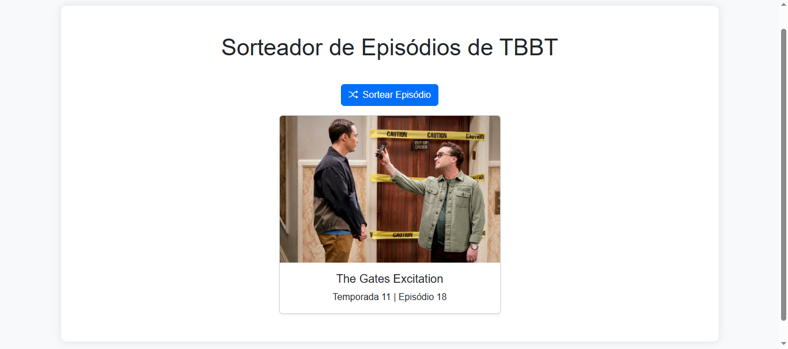

# Sorteador de Episódios de The Big Bang Theory 🎲📺

Olá! Meu nome é Ebert, sou fã de The Big Bang Theory e já assisti todos os episódios da série. Como gosto muito da área de desenvolvimento backend, resolvi criar esse projeto como forma de praticar minhas habilidades com **Spring Boot** — e de quebra, reviver bons momentos aleatórios da série! 😄

## 🎯 Objetivo

Esse sistema sorteia aleatoriamente um episódio de TBBT, mostrando o nome, número, temporada e uma imagem do episódio. Ideal para quando bate a vontade de assistir algo leve e você não sabe por onde começar!

## 🚀 Tecnologias usadas

-   Java 23
-   Spring Boot 3
-   Spring Data JPA
-   H2 Database (em memória)
-   Bootstrap 5 (frontend)
-   JavaScript + HTML + CSS
-   Integração com a [TVmaze API](https://www.tvmaze.com/api)
